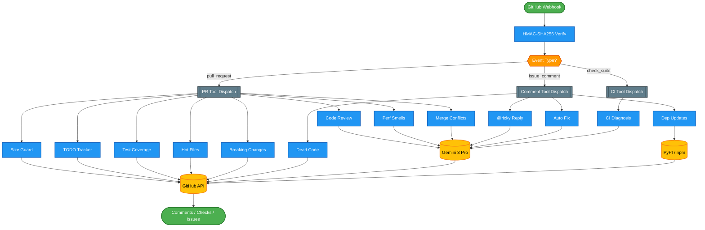

# Ricky

GitHub App that reviews PRs and manages code quality as Ricky LaFleur from Trailer Park Boys. Powered by Gemini 3 Pro via Vertex AI, deployed on a NixOS MicroVM.

13 tools across 3 webhook event types. Technical advice is correct — the delivery is pure Ricky.

## Architecture



## Tools (13)

Every PR triggers the full automatic tool suite in parallel. Command tools run on `@ricky` mentions.

### Automatic (on every PR)

| Tool | What It Does |
|------|-------------|
| **review** | Full code review via Gemini — individual inline comments with severity badges, suggestion blocks, Rickyisms |
| **size_guard** | PR size enforcement via GitHub Checks API (configurable line/file thresholds) |
| **todo_tracker** | Scans diff for new TODO/FIXME/HACK/XXX, creates GitHub Issues linked to code location |
| **test_coverage** | Detects new public functions with no corresponding test files |
| **benchmark** | LLM-powered performance smell detection (N+1 queries, O(n^2), blocking I/O in async) |
| **blame** | Identifies hot files (changed too frequently) with commit history context |
| **breaking** | Detects removed exports, changed function signatures, modified API routes |
| **conflict** | When PR has merge conflicts, posts resolution strategy with Gemini analysis |

### On Demand (via comments)

| Tool | Trigger | What It Does |
|------|---------|-------------|
| **mention_reply** | `@ricky` | In-character reply to any question |
| **auto_fix** | `@ricky fix` | Generate fix branch + PR for issues (opt-in via env var) |
| **dead_code** | `@ricky dead-code` | Find unused imports, placeholder `pass` blocks, orphaned functions |
| **dep_update** | `@ricky outdated` | Check PyPI/npm for outdated packages, post report |

### CI Events

| Tool | Trigger | What It Does |
|------|---------|-------------|
| **ci_reporter** | `check_suite` / `check_run` failure | Fetches CI output, Gemini diagnoses root cause, posts fix suggestion |

## Project Structure

```
src/
├── main.py                  # FastAPI app, webhook endpoint, HMAC verification
├── webhook_handler.py       # Thin event router — dispatches to registered tools
├── gemini_client.py         # Vertex AI REST client, persona prompt, JSON parsing
├── diff_parser.py           # Unified diff parser (file paths, line numbers, hunks)
├── _base_auth.py            # GitHub App JWT auth, installation token caching
├── github_auth.py           # Legacy auth wrapper (backward compat)
├── config.py                # Pydantic BaseSettings (secrets, Gemini, tool config)
├── errors.py                # Error hierarchy (AgentError, GitHubError, GeminiError, ToolError)
├── models/
│   ├── github.py            # PullRequest, Repository, CheckRunOutput, Label
│   ├── review.py            # ReviewResult, ReviewComment, Severity
│   └── tools.py             # SizeGuardResult, TodoItem, CIFailureReport
├── clients/
│   ├── _base.py             # Base httpx client with auth header injection
│   └── github.py            # Full GitHub API client (comments, reviews, checks,
│                            #   issues, labels, trees, branches, PRs, CI logs)
└── tools/
    ├── _registry.py         # Decorator-based tool registry + event dispatch
    ├── review.py            # Code review (inline comments + summary)
    ├── size_guard.py        # PR size check → GitHub Check Run
    ├── todo_tracker.py      # TODO/FIXME scanner → GitHub Issues
    ├── ci_reporter.py       # CI failure diagnosis via Gemini
    ├── test_coverage.py     # Test gap detection for new functions
    ├── benchmark.py         # Performance anti-pattern detection via Gemini
    ├── blame.py             # Hot file / churn detection
    ├── breaking.py          # Breaking change detection (signatures, exports, routes)
    ├── auto_fix.py          # Generate fix PRs (@ricky fix)
    ├── dead_code.py         # Unused import / placeholder detection
    ├── dep_update.py        # Outdated dependency check (PyPI, npm)
    └── conflict.py          # Merge conflict analysis + resolution advice
```

## Configuration

### Environment Variables

| Variable | Default | Purpose |
|----------|---------|---------|
| `GCP_PROJECT` | (from file) | GCP project for Vertex AI |
| `GCP_LOCATION` | `global` | Vertex AI endpoint location |
| `GEMINI_MODEL` | `gemini-3.1-pro-preview` | Model to use |
| `RICKY_MAX_PR_LINES` | `500` | Size guard line threshold |
| `RICKY_MAX_PR_FILES` | `15` | Size guard file threshold |
| `RICKY_AUTO_FIX_ENABLED` | `false` | Enable @ricky fix (opt-in) |
| `RICKY_TODO_CREATE_ISSUES` | `true` | Create issues from TODOs |

### Secrets

All mounted read-only at `/secrets` via virtiofs:

| File | Purpose |
|------|---------|
| `app-id` | GitHub App ID |
| `private-key.pem` | GitHub App RSA private key |
| `webhook-secret` | Webhook HMAC-SHA256 secret |
| `gcp-service-account.json` | GCP service account key (Vertex AI) |
| `gcp-project` | GCP project ID |
| `tailscale-auth-key` | Tailscale auth key (reusable) |

## GitHub App Permissions

| Permission | Level | Used By |
|-----------|-------|---------|
| `contents` | read & write | auto_fix (create branches/files), diff fetching, styleguide |
| `pull_requests` | write | Inline comments, review summaries |
| `issues` | write | TODO issue creation, PR comments |
| `checks` | write | Size guard Check Runs |
| `actions` | read | CI log fetching |

### Webhook Events

- `pull_request` (opened, synchronize, reopened)
- `issue_comment` (created)
- `check_suite` (completed)
- `check_run` (completed)

## Infrastructure

### MicroVM (NixOS module: `ricky.nix`)

- **Hypervisor:** QEMU (2 vCPUs, 1024 MB RAM)
- **Network:** TAP interface on `microbr` bridge, static IP `192.168.83.10/24`
- **Tailscale:** Runs inside the VM with Funnel for public HTTPS
- **virtiofs shares:** /nix/store (ro), /secrets (ro), tailscale state (rw)
- **Hardening:** `ProtectSystem=strict`, `ProtectHome=true`, `NoNewPrivileges=true`

### Deploy

```bash
sudo nix flake update ricky-src
sudo nixos-rebuild switch --flake /etc/nixos#phoenix
```

### Verify

```bash
curl http://192.168.83.10:8000/health         # from host
curl http://192.168.83.10:8000/debug/logs      # recent log buffer
```

## Adding Ricky to a Repo

1. Install the GitHub App on the repo
2. Optionally add `.gemini/styleguide.md` with persona overrides
3. Open a PR — all 8 automatic tools fire
4. Use `@ricky` commands in comments for on-demand tools
